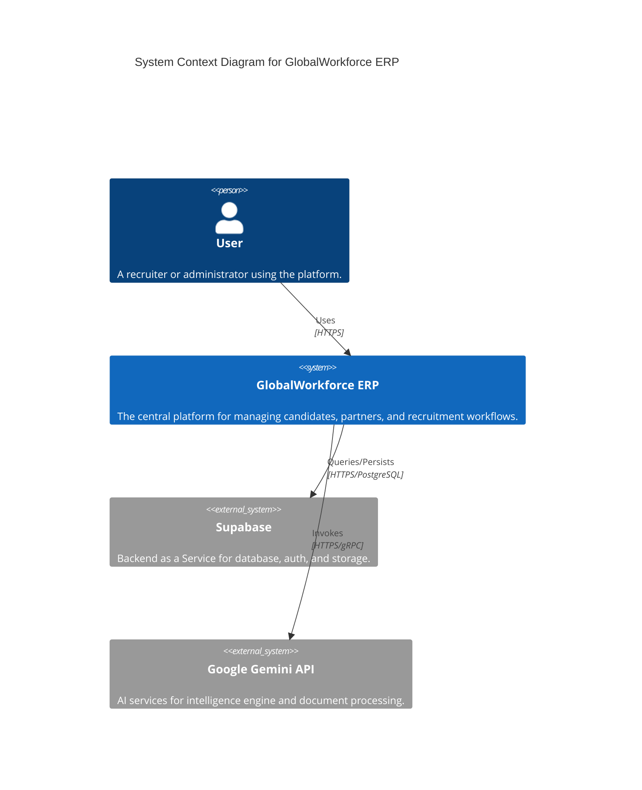
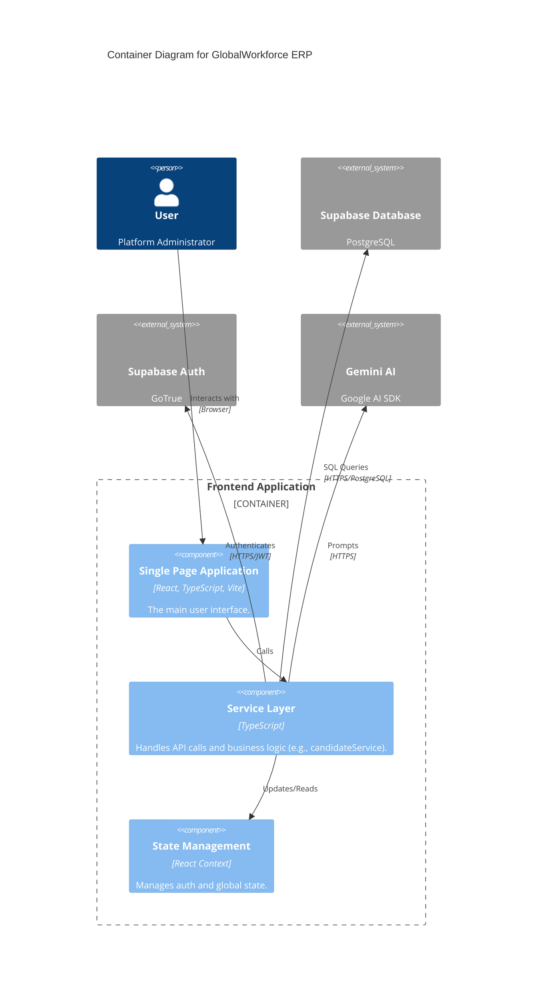

# System Architecture (C4 Model)

This document provides a high-level overview of the GlobalWorkforce ERP system architecture using the C4 model.

## Level 1: System Context Diagram

## Level 2: Container Diagram

## Key Technologies
- **Frontend**: React 18, TypeScript, Tailwind CSS, Vite.
- **Backend**: Supabase (PostgreSQL, Auth, Edge Functions).
- **AI**: Google Gemini Pro (via `@google/generative-ai`).
- **Testing**: Vitest (Unit), Playwright (E2E).
